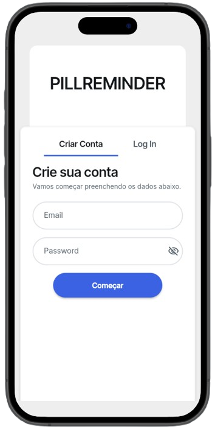
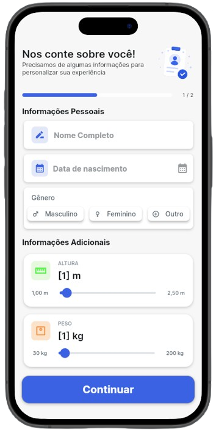
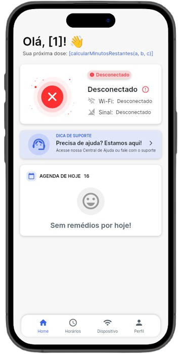
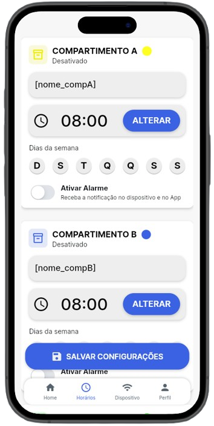
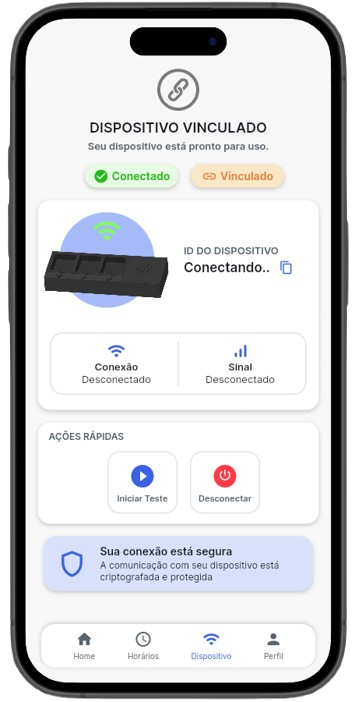
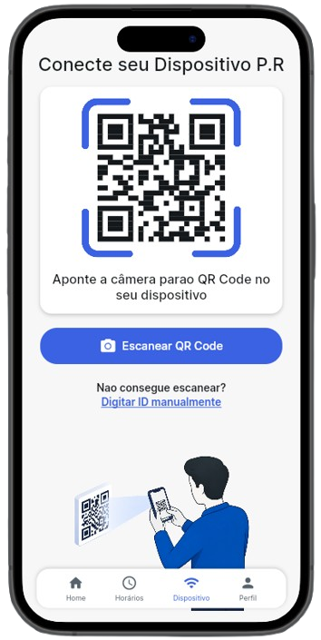
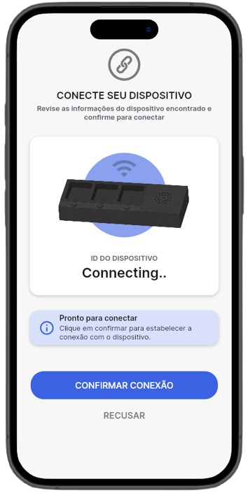
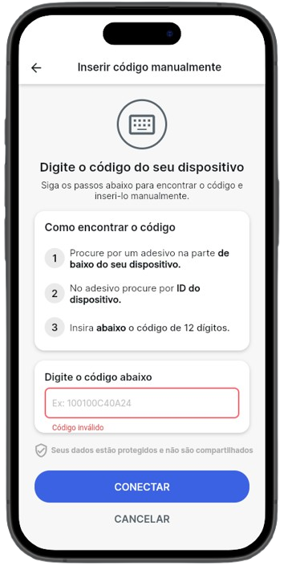
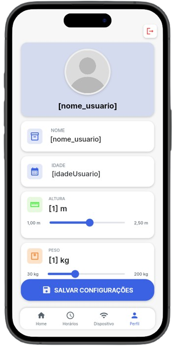

# PillReminder

<p align="center">
  <h3 align="center">Smart Medication Adherence Platform</h3>
  <p align="center">
    A connected ecosystem that combines a mobile application, cloud services, and an IoT device to improve medication adherence and treatment monitoring.
  </p>
</p>

---

## About

PillReminder is a smart medication management platform designed to help patients and caregivers follow treatment routines more safely and efficiently.

The platform integrates a mobile application, Firebase cloud services, and an ESP32-powered smart device to create a complete medication adherence experience.

By combining software and hardware, PillReminder provides medication scheduling, administration tracking, device synchronization, and caregiver support in a single ecosystem.

---

## Main Features

### Mobile Application

- Secure user authentication
- User onboarding flow
- Medication scheduling
- Smart medication reminders
- Medication administration history
- Device management
- Manual and automatic device linking
- User profile management
- Caregiver support

### Smart Device

- ESP32-based firmware
- Wi-Fi connectivity
- Physical confirmation buttons
- Medication compartment management
- Real-time synchronization with the mobile application
- Visual user feedback

---

# Application Screens

## Authentication



---

## User Registration



---

## Home Dashboard



---

## Medication Schedule



---

## Device Pairing

### Automatic Connection



### Device Search



### Confirmation



### Manual Connection



---

## User Profile



---

## System Architecture

```text
                Mobile Application
                        │
                        │
                Firebase Cloud
                        │
                        ▼
                Smart Device
                        │
                        ▼
                      ESP32
```

---

## Technology Stack

### Mobile Development

- Flutter
- Dart
- FlutterFlow

### Backend & Cloud

- Firebase Authentication
- Cloud Firestore
- Firebase Storage

### Embedded Systems

- ESP32
- Arduino Framework
- Wi-Fi Communication

### Design & Prototyping

- Photoshop
- Fusion 360

### Version Control

- Git
- GitHub

---

## Development Status

### Completed

- Mobile application development
- User authentication system
- Medication scheduling
- Device pairing workflow
- Firebase integration
- ESP32 integration
- Functional hardware prototype
- Functional enclosure prototype

### In Progress

- PCB development
- Final enclosure version
- Product refinement
- System optimization

---

## Repository Structure

```text
pillreminder/
│
├── screenshots/
├── esp32/
├── docs/
└── README.md
```

---

## Project Vision

PillReminder was created with the goal of improving medication adherence through the integration of mobile technology, cloud services, and embedded systems.

The project aims to provide a practical and accessible solution capable of assisting both patients and caregivers in treatment management.

---

## Author

**Raphael Soares Casado**

GitHub: https://github.com/raphaelsoares01
